### databases and tables ###

#### show all databases ####

<code>show databases; </code> command displays all databases within your mysql server.

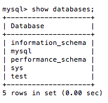

Before being able to work with a database you need to specify which database you would like to work with using the `use`command as per below image.

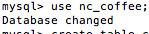

#### list all tables ####

to get a view of a list of tables in a database invoke the command <code>show tables; </code> this will be the output. 

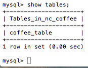

#### create a table ####

To create a table use the **create table %tablename%** command as show in the below screen.

what you see in parenthesis describes the data type and name for each column. We create a column called ID with the data type integer which means a number. 

For each other column we specify it will be characters in devlopment terminology is called a string. **VARCHAR** is a function in SQL that specifies th maximum charactr length in this case 255.

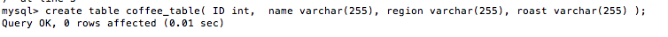

describe coffee table

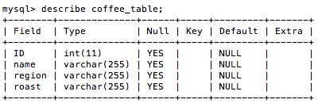

####insert a record into a table ####

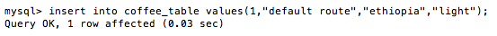
show all entries within a table by using the ``select`` command.

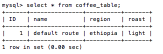

####select a specific column ####

from the ``coffee_table`` we want to select only specific data in this example we only want to output the name column by invoking <code> select name from coffee_table; </code>

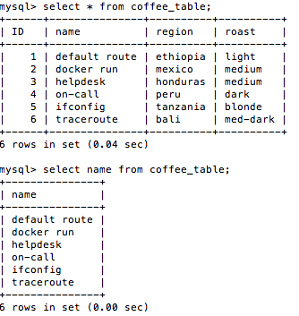

#### select records for a specific criteria in a column ####

#### select records for multiple criterias ####

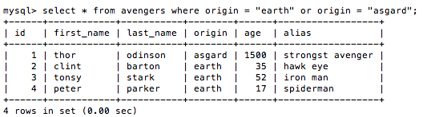

#### filter by a specific value ####

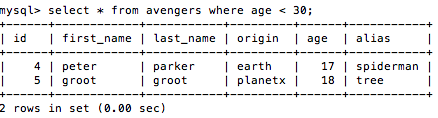

#### filter table where it doesn't contain a specific value ####

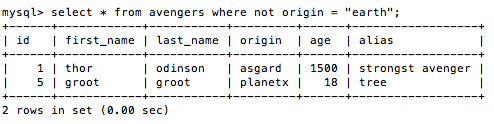

#### delete a record containing a value ####

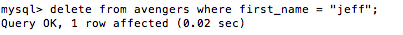

#### update a record  ####

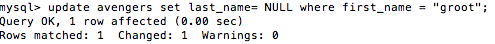

#### order by  ####

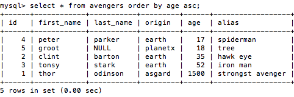

#### order by oldest ####

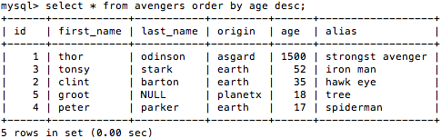

#### insert a new column ####

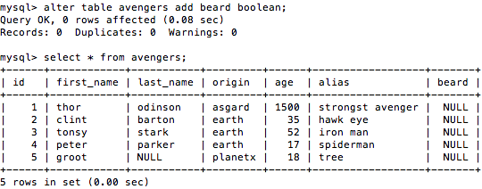

